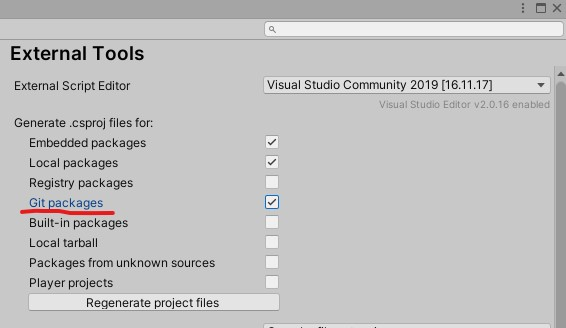

# OpenSplinePlacer
An open-source Unity level design tool that can create city blocks, roads, and other lines of objects via Splines.

## OSP Workflow

### OSP Definitions

Start by creating `OSPSplineObject` scriptable objects in your assets to define each possible set of objects that can spawn at each point in your spline. The **Spline Object** allows you to configure a base object, stack objects that will be placed on top of the base depending on `stackHeightFromOrigin`, and supports which will extend in a direction to connect the object to the ground.

You must also create an `OSPSplineObjectSet` scriptable object which will define what **Spline Objects** can appear when you run the placer generation. Each object is assigned to a **Spline Object Container** which also contains a probability value. This value determines how likely it is that the object will spawn relative to the other items in the list.

### OSP Placement

After creating a spline with Unity Splines, you will have a GameObject with the `SplineContainer` component in your scene. Add the `OSPSplinePlacer` component to this object. Now you can assign the `OSPSplineObjectSet` that defines the spawn parameters to this placer object. You can also configure parameters for the placer object such as the random seed to vary the final output.

When ready, you can right click the component and run **Generate Spline Objects** to start the generation. Alternatively, you can use the registered shortcut (*Shift+O* by default) to start generating as well. The objects will become children of the main placer object.

**NOTE:** Each time you generate spline objects, all of the placer's children objects will be destroyed before the new objects are spawned.

If all went well, you will now see your created prefab objects positioned along the spline!

## Installation

### Prerequisites

The following packages are required for OpenSplinePlacer to work correctly:

- UnityEngine.Splines

OpenSplinePlacer was created with Unity 6.3.8f1, though it will likely work in earlier versions of Unity too so long as they support Unity Splines.

### Recommended Installation

If you're looking for any specific release of OpenSplinePlacer, you can specify a release tag with the hashtag like so: "https://github.com/RobProductions/OpenSplinePlacer.git#ReleaseNumber"

1. Open the [Package Manager](https://docs.unity3d.com/2020.3/Documentation/Manual/upm-ui.html) in Unity
2. Copy the GitHub "HTTPS Clone" URL for OpenSplinePlacer: [https://github.com/RobProductions/OpenSplinePlacer.git](https://github.com/RobProductions/OpenSplinePlacer.git)
3. Click the '+' icon and hit *"Add package from git URL"*
4. Paste the HTTPS Clone URL to the popup and (optionally) add on *#YourChosenReleaseNumer* to the end, then hit enter
5. Wait for download to complete

### Optional Installations

**OpenUPM installation**

Check [this link](https://openupm.com/docs/getting-started.html#installing-a-upm-package) for the recommended steps.

**Local package installation**

Feel free to download the project as .zip and place it somewhere on your local drive. Then use the *"Add package from disk"* option in the Package Manager to add this local package instead of the remote installation. 

**Assets path installation**

OpenSplinePlacer should also work as a part of your `Assets/` directory if you'd like to customize it for your specific project without having to deal with the package system. Simply download the project as a .zip and place the contents anywhere in your Assets folder, as long as they are self-contained so that the Assembly Definition doesn't confuse itself with your other files.

### Want more details about the API?

If you installed via Git, you may want to make sure that you've enabled .csproj for "Git Packages" in *Edit->Preferences->External Tools*

Now you'll be able to see summary comments including descriptions on return values, input parameters, and functions straight from your IDE.

## Credits & Details

Created by [RobProductions](https://www.robproductionsgames.com/). RobProductions' Steam games can be found [here](https://store.steampowered.com/developer/robproductions).

### License

This work is licensed under the MIT License. The intent for this software is to provide a useful development tool without requirement of attribution. However, attribution for uses of this package would be much appreciated. The code may be considered "open source" and could include snippets from multiple collaborators.

The code is provided "as is" and without warranty. 
